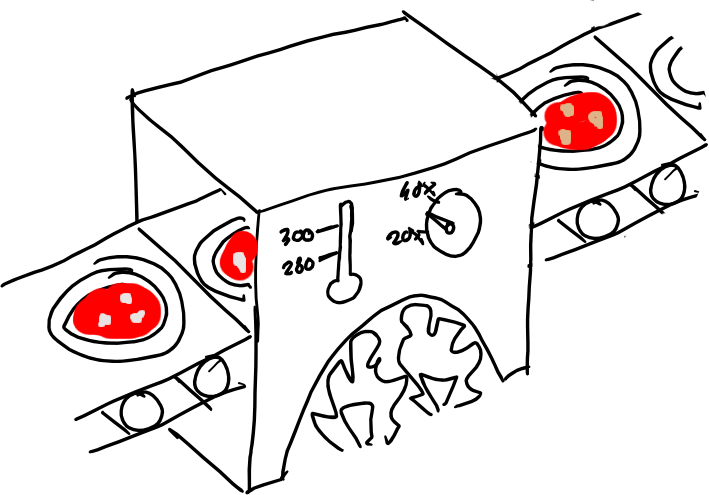

# Linear Pizza Oven

## Description

Consider the scenario depicted in the figure below.



The company DreamPizza bought an oven with the aim of increasing their pizza's quality.
The oven is a smart one. 
It makes use of a conveyor belt that takes pizzas in and out of the oven.
Moreover, it has several sensors that continuously produce data.
Carl, a data scientist working for DreamPizza, is particularly focused on two sensors:

- **S1**. The sensor S1 is positioned at the entrance of the oven.
    It has a camera that, using image recognition algorithms, is capable of detecting pizza toppings.
    Since it is the first sensor to analyze a pizza, it also assigns to each pizza a unique id.
    The sensor S1 exploits the [Pizza Ontology](https://protege.stanford.edu/ontologies/pizza/pizza.owl) to produce an RDF stream.
    An example of such a stream is shown.

```json
{
   "@context": {
      "rdf": "http://www.w3.org/1999/02/22-rdf-syntax-ns#",
      "rdfs": "http://www.w3.org/2000/01/rdf-schema#",
      "xsd": "http://www.w3.org/2001/XMLSchema#",
      "pizza": "http://www.co-ode.org/ontologies/pizza/pizza.owl#"
   },
   "@base": "http://linkeddata.stream/streams/pizza-S1/1594979716168",
   "@id": "a2c7cd0d-0632-43c1-a24f-74b4dc983b79",
   "@type": "pizza:Pizza",
   "pizza:hasTopping": [
      {
         "@id": "pizza:TomatoTopping"
      },
      {
         "@id": "pizza:MozzarellaTopping"
      },
      {
         "@id": "pizza:PeperoniSausageTopping"
      }
   ]
}	
```

- **S2**. The sensor S2 is positioned inside the oven.
    It senses the temperature and, exploiting the [Sensor-Observation-Sampling-Actuator ontology](SOSA\footnote{https://www.w3.org/TR/vocab-ssn/}), outputs an RDF stream with the id of the pizza and the oven's temperature.
    Multiple measures for the same pizza id are provided, denoting the temperatures of the oven during the cooking process.
    An example of the RDF stream produced by S2 is shown.

```json
{
   "@context": {
      "qudt": "http://qudt.org/1.1/schema/qudt#",
      "qudt-unit": "http://qudt.org/1.1/vocab/unit#",
      "rdf": "http://www.w3.org/1999/02/22-rdf-syntax-ns#",
      "rdfs": "http://www.w3.org/2000/01/rdf-schema#",
      "sosa": "http://www.w3.org/ns/sosa/",
      "xsd": "http://www.w3.org/2001/XMLSchema#"
   },
   "@base": "http://linkeddata.stream/streams/pizza-S2/1594979721678",
   "@id": "7bc22147-1c65-41eb-bab1-d77fee75e92d",
   "@type": "sosa:Observation",
   "sosa:hasFeatureOfInterest": {
      "@id": "9b58f3fc-d3cb-4fbe-9e28-9794c5cd5205"
   },
   "sosa:hasResult": {
      "@type": "qudt:QuantityValue",
      "qudt:numericValue": {
         "@type": "xsd:decimal",
         "@value": 276.58854030373624
      },
      "qudt:unit": {
         "@id": "qudt-unit:DegreeCelsius"
      }
   }
}	
```

Observing the RDF streams from S1 and S2, Carl is able to observe, for each pizza, the toppings and the temperature of the oven during the cooking process.
Carl wonders if it is possible to exploit such data to automatically detect the name of each pizza starting from its toppings and, analyzing the oven temperature during its cooking process, assert on the quality of such pizza.
In other words, he wants to know if a pizza has been cooked correctly or not.
A colleague of Carl, Frank, has a relational database containing the cooking temperature for each named pizza.
A small dump of the table Pizza from such database is shown.

|name        | TempAvg | TempStd |
|------------|---------|---------|
|Margherita  | 280     | 10      |
|American    | 275     | 5       |

Carl needs your help to develop and deploy a Stream Reasoning application that, exploiting the data streams from the sensors and the relational database from Frank, is able to detect whether each pizza passing thought the oven is cooked correctly or not.

## Setup

A `docker-compose.yaml` file is provided.

```bash
docker-compose up -d
```

There are many components:
- **streams**. It exposes the websockets of sensor S1 and S2 at port `9400` and `9500`, respectively. You can inspect such websockets using a simple websocket client like [Weasel](https://addons.mozilla.org/en-US/firefox/addon/websocket-weasel).
- [**jasper**](https://github.com/riccardotommasini/yasper)
- [**ontop**](https://ontop-vkg.org/)

A [demo](https://github.com/riccardotommasini/colorwave/tree/RW-2020) using the same stack of technologies was presented during [RW-2020](http://streamreasoning.org/events/rw2020).

The access jupyter at [localhost](http://localhost:8080).

**TO BE NOTICED**:
jasper 1.1 does not support the sparql service clause, thus you have to extract the ontology from ontop and *statically* use it inside jasper.

## TODO

Create a Jupyter notebook, that:
- exploits rsplib and jasper.
- uses a RSP-QL query to filter the pizzas that are not correctly cooked.

A pizza is not correctly cooked if, during its cooking process, the oven reaches a temperature that deviates from the recommended average temperature for 2 or more standard deviations.